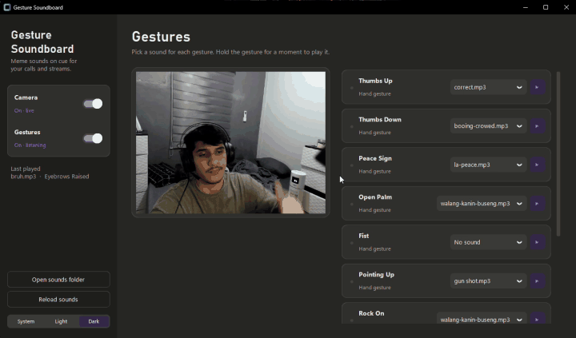

# Gesture Soundboard

Play meme sounds with hand gestures and facial expressions, live on your webcam. Built for streamers and video calls.



🎬 Watch the full demos with sound:
- [Version 2](https://drive.google.com/file/d/1EY29OSpO9DdGiJB4h5Xu8Q9E5znVsyeM/view?usp=sharing): virtual camera, global hotkey, tray icon, light theme
- [Version 1](https://drive.google.com/file/d/1ATZzzxDKFa7Ssc0xhwM8wj_Cj2zCe84p/view?usp=sharing): the original soundboard

## Download (Windows)

**[⬇️ Download the latest release](https://github.com/Moe-Balmeh/gesture-soundboard/releases/latest)**, no Python needed.

1. Download `GestureSoundboard-v1.0.0-windows.zip` and unzip it (e.g. into Downloads or Documents).
2. Open the `Gesture Soundboard` folder and double-click **Gesture Soundboard.exe**.
3. Windows may show "Windows protected your PC" since the app isn't signed. Click **More info → Run anyway**.

Keep the whole folder together, the exe needs `_internal`, `assets` and `models` next to it. Your settings are saved in `config.json` in that same folder.

## Run from source

Double-click **`Start Soundboard.bat`**, or:

```powershell
py -3.11 -m venv .venv
.\.venv\Scripts\python.exe -m pip install -r requirements.txt
.\.venv\Scripts\python.exe main.py
```

The first run downloads the AI models (~10 MB) into `models/`.

To build the `.exe` yourself: `.\.venv\Scripts\python.exe -m pip install pyinstaller`, then `.\.venv\Scripts\python.exe build.py`. The app and a zip end up in `dist/`.

## How it works

```
 Webcam ──► CAMERA ──► DETECTION ──► LOGIC ──► AUDIO ──► 🔊 speakers
           (OpenCV)   (MediaPipe)   (engine)  (pygame)
                                                  └─► 🎙️ virtual mic (sounddevice) ◄── your real mic
                                       │
                                       ▼
                                      UI  (window, live preview, settings)
```

1. **Camera** grabs a frame from the webcam (~30 per second).
2. **Detection** runs two Google MediaPipe AI models on it: one recognizes hand gestures, the other scores face movements from 0 to 1 (e.g. `jawOpen = 0.9`).
3. **Logic** decides when to play a sound: a gesture must be held for a few frames (so random movements don't trigger it), and each gesture has a cooldown (so it can't spam).
4. **Audio** plays the sound picked for that gesture on your speakers, and (if the virtual mic is on) mixes it with your real mic into a virtual cable, so people on the call hear both. Your mic and the cable run on separate clocks, so the mixer keeps the mic buffer short (skips ahead if it builds past 0.1 s) to stop your voice from slowly lagging behind.
5. **UI** shows the live preview and lets you choose sounds. It runs separately from the camera loop (on its own thread), so the window never freezes.

## Project structure

```
gesture-soundboard/
├── main.py                  Starts the app
├── Start Soundboard.bat     Double-click launcher
├── build.py                 Builds the .exe and the release zip
│
├── app/
│   ├── ui/                  UI/UX: everything you see
│   │   ├── theme.py             colors and fonts
│   │   ├── widgets.py           reusable pieces (cards, switches, gesture rows)
│   │   ├── dropdown.py          the sound / mic picker with its popup list
│   │   ├── tray.py              the tray icon and its menu
│   │   ├── help_button.py       the ? Help popup (what to install, how to use)
│   │   ├── hotkey_card.py       the card for changing the keyboard shortcut
│   │   ├── sound_card.py        mic picker and volume sliders
│   │   └── main_window.py       the window layout and buttons
│   │
│   ├── camera/              OpenCV: turns the webcam on/off, reads frames
│   │   ├── webcam.py
│   │   └── virtual_cam.py       sends the video to Zoom / Meet / TikTok Live
│   │
│   ├── detection/           MediaPipe AI: finds gestures in a frame
│   │   ├── gestures.py          the gesture list and face thresholds (tune here)
│   │   └── detector.py          runs the AI models
│   │
│   ├── logic/               The brain: connects camera → detection → audio
│   │   ├── engine.py
│   │   ├── hotkeys.py           global keyboard shortcut (works in any app)
│   │   └── single_instance.py   opening the app twice shows the running one
│   │
│   ├── audio/               Plays sound files
│   │   ├── sound_player.py
│   │   └── virtual_mic.py       mixes your mic + the sounds into Zoom / Meet / Discord
│   │
│   ├── settings/            Saves your choices to config.json
│   │   └── settings.py
│   │
│   └── paths.py             Where files live on disk
│
├── assets/sounds/           The sound files (add your own here)
└── models/                  AI models (auto-downloaded, not in git)
```

## Use it in Zoom / Meet / TikTok Live

1. Install [OBS Studio](https://obsproject.com/) (the app uses its virtual camera driver, OBS doesn't need to be open).
2. Turn on **Virtual camera** in the sidebar.
3. In your call or stream app, pick **OBS Virtual Camera** as your camera.

### So the call can hear you and the sounds (virtual mic)

1. Install [VB-Audio Virtual Cable](https://vb-audio.com/Cable/) (free) and restart your PC.
2. Turn on **Virtual mic** in the sidebar.
3. Under **Call audio**, pick your real microphone. The app mixes your voice and the sounds together.
4. In your call app, pick **CABLE Output** as your microphone.

The **Voice** and **Sounds** sliders set how loud each one is in the call. The ▶ preview buttons only play on your speakers, so you can test sounds without the call hearing them.

**Discord tips:** set Noise Suppression to *None* (Krisp removes anything that isn't a voice, including the sounds) and turn off automatic input sensitivity.

## Gestures

| Hand | Face |
|---|---|
| Thumbs Up, Thumbs Down, Peace Sign, Open Palm, Fist, Pointing Up, Rock On | Mouth Open, Big Smile, Eyebrows Raised |

Each gesture has its own on/off switch, and **Ctrl + Shift + G** turns all of them on/off from any app (you can change the shortcut in the app).

## Sounds

Drop `.mp3` / `.wav` / `.ogg` files into `assets/sounds/`, click **Reload sounds**, and pick one for each gesture from the dropdowns.

## Roadmap

- [x] Hand gesture + face expression detection
- [x] Sound picker UI with light/dark mode
- [x] Camera on/off toggle
- [x] Virtual camera output (use in Zoom / Meet / TikTok Live Studio)
- [x] 720p HD at 30 fps
- [x] System tray icon (keeps running when the window is closed)
- [x] Global hotkey to turn gestures on/off (changeable in the app)
- [x] Turn individual gestures on/off
- [x] Virtual microphone: your voice + the sounds mixed into Zoom / Meet / Discord
- [x] Packaged `.exe` release
